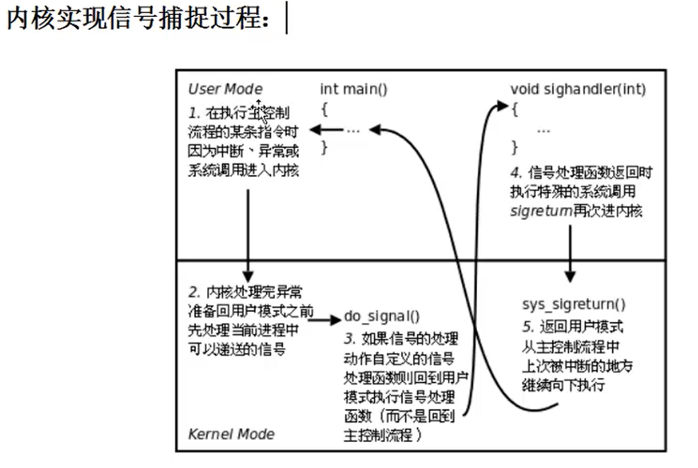

- [linux服务器编程](#linux服务器编程)
  - [简介](#简介)
  - [1.环境变量](#1环境变量)
    - [①环境变量是什么](#环境变量是什么)
    - [②常用环境变量](#常用环境变量)
    - [③环境变量函数](#环境变量函数)
  - [2.进程控制](#2进程控制)
    - [fork函数](#fork函数)
    - [getpid](#getpid)
    - [getuid/getgid](#getuidgetgid)
    - [进程共享](#进程共享)
    - [gdb调试](#gdb调试)
    - [exec函数族](#exec函数族)
      - [execlp函数*](#execlp函数)
      - [execl函数*](#execl函数)
      - [execle函数?](#execle函数)
      - [execv函数](#execv函数)
      - [execvp函数](#execvp函数)
      - [execvpe函数？](#execvpe函数)
  - [3.进程回收](#3进程回收)
    - [1.孤儿进程](#1孤儿进程)
    - [2.僵尸进程](#2僵尸进程)
    - [3.进程回收](#3进程回收-1)
      - [（1）wait 阻塞函数](#1wait-阻塞函数)
      - [（2）waitpid](#2waitpid)
  - [4.信号](#4信号)
    - [1.信号基本概念和机制](#1信号基本概念和机制)
      - [1.信号的特质](#1信号的特质)
      - [2.与信号相关的事件和状态](#2与信号相关的事件和状态)
      - [3.信号四要素](#3信号四要素)
    - [2.信号的产生](#2信号的产生)
      - [1.终端按键产生信号](#1终端按键产生信号)
      - [2.硬件异常产生信号](#2硬件异常产生信号)
      - [3.kill函数/命令产生信号/raise/abort](#3kill函数命令产生信号raiseabort)
      - [3.软条件产生信号](#3软条件产生信号)
        - [1.alarm函数](#1alarm函数)
        - [2.setitimer函数](#2setitimer函数)
    - [3.信号集操作函数](#3信号集操作函数)
      - [1.信号集设定](#1信号集设定)
      - [2.sigprocmask函数](#2sigprocmask函数)
      - [3.sigpending函数](#3sigpending函数)
    - [4.信号捕捉](#4信号捕捉)
      - [1.signal函数](#1signal函数)
      - [2.sigaction函数](#2sigaction函数)
      - [信号捕捉特性](#信号捕捉特性)

# linux服务器编程

## 简介

```
一，环境编程
1.进程相关概念
	并发
	单道程序设计
	多道程序设计
	cpu/mmu
	进程控制块
	进程状态
2.环境变量
	常用环境变量/作用
	函数
3.进程控制原语
	fock函数
		创建子进程的架构
	exec函数族
		各个函数的参数使用方法/作用
	wait/waitpid
		回收子进程的一般方式
```

## 1.环境变量

### ①环境变量是什么

```c++
指操作系统中用来指定操作系统运行环境的一些参数，通常：
1）字符串(本质)
2）有统一格式:名=值[:值]
3)用来描述进程环境信息
存储形式:与命令行参数类似。char*[],数组名environ，内部存储字符串，NULL作为哨兵结尾
使用形式：与命令行参数类似。
加载位置：与命令行参数类似。位于用户区，高于stack的起始位置。
引入环境变量表：须声明环境变量。
extern char** environ;
```

### ②常用环境变量

```shell
查看$PATH:echo $PATH
查看$SHELL:echo $SHELL
查看$HOME:echo $HOME
查看$LANG:echo $LANG
查看$TERM:echo $TERM(终端类型)
```

### ③环境变量函数

```c++
//getenv       
#include <stdlib.h>
char *getenv(const char *name);
//setenv，成功0失败-1 on error
#include <stdlib.h>
int setenv(const char *name, const char *value, int overwrite);
//unsetenv，成功0失败-1 on error
#include <stdlib.h>
int unsetenv(const char *name);
```

## 2.进程控制

### fork函数

```c++
//创建一个子进程
#include <unistd.h>
pid_t fork(void);
//失败返回-1；成功返回：
//①父进程返回子进程的id（非负）
//②子返回0
pid_t
//表示进程id，为了表示-1，它是有符号整形
//0不是有效进程
//init进程最小，为1
```

### getpid

```C++
       #include <sys/types.h>
       #include <unistd.h>

       pid_t getpid(void);
       pid_t getppid(void);

DESCRIPTION
       getpid() returns the process ID of the calling process.  (This is often used by routines that generate unique temporary filenames.)

       getppid() returns the process ID of the parent of the calling process.
```


### getuid/getgid

```c++
       #include <unistd.h>
       #include <sys/types.h>
       uid_t getuid(void);
       uid_t geteuid(void);
DESCRIPTION
       getuid() returns the real user ID of the calling process.
       geteuid() returns the effective user ID of the calling process.

       #include <unistd.h>
       #include <sys/types.h>
       gid_t getgid(void);
       gid_t getegid(void);
DESCRIPTION
       getgid() returns the real group ID of the calling process.
       getegid() returns the effective group ID of the calling process.
```

### 进程共享

```c++
父子进程相同处：
全局变量、data、.text、栈、堆、环境变量、用户id、宿主id、进程工作目录、信号处理方式
父子进程不同处：
1.进程id
2.fock返回值
3.父进程id
4.程序运行时间
4.闹钟（定时器）
5.未决信号集
```

- 父子进程遵循实时共享写时复制的原则

- 进程共享：

  （1）文件描述符

  （2）mmap建立的映射区gdb调试


### gdb调试

```C++
使用gdb调试时，gdb只能跟踪一个进程
set follow-fork-mode child命令设置gdb在fork之后跟踪子进程
set follow-fork-mode parent命令设置gdb在fork之后跟踪父进程
```

### exec函数族

```c++
	fork创建子进程后执行的是和父进程相同的程序（可能执行不同的代码分支），子进程往往要掉用一种exec函数以执行另一个程序。当进程调用一种exec函数时，该进程的用户空间代码和数据完全被新程序替换，从新程序的启动例程开始执行。/*调用exec并不创建新进程，所以调用exec前后盖进程id未改变。*/
	将当前进程的.text、.data替换为所要加载程序的.text、.data，然后让进程从新的.text的第一条指令开始执行，但进程id不变，换核不换壳。
    exec函数：
int execl(const char *path, const char *arg, ...);
int execlp(const char *file, const char *arg, ...);

int execle(const char *path, const char *arg, ..., char *const envp[]);
int execv(const char *path, char *const argv[]);
int execvp(const char *file, char *const argv[]);
int execvpe(const char *file, char *const argv[], char *const envp[]);
```

#### execlp函数*

```c++
//加载一个进程，借助PATH环境变量
int execlp(const char *file, const char *arg, ...);
//成功无返回，失败返回-1
//参数1：要加载的程序的名字。该函数需要配合PATH环境变量来用，当PATH中所有目录搜索后没有参数1则出错返回。
//该函数通常用来调用系统程序,如ls\date\cp\cat等
```

例：

```c++
#include <stdio.h>
#include <stdlib.h>
#include <unistd.h>

int main()
{
    pid_t pid;
    pid = fork();
    if(pid == -1)
    {
        perror("fork error!");
        exit(1);
    }else if(pid > 0)
    {
        printf("parent!\n");
    }else
    {
        execlp("ls", "ls", "-a", "-l", NULL);
    }
    return 0;
}
```

#### execl函数*

```c++
//加载一个进程，通过路径+程序名来加载
int execl(const char *path, const char *arg, ...);
//成功无返回，失败返回-1
//对比execlp
execlp("ls", "ls", "-l", "-F", NULL);		//使用程序名在PATH中搜索
execl("/bin/ls", "ls", "-l", "-F", NULL);	//使用参数1给出的路径搜索
```

#### execle函数?

```c++
int execle(const char *path, const char *arg, ..., char *const envp[]);
```

例：

#### execv函数

```c++
int execv(const char *path, char *const argv[]);
```

例：

```c++
char * argv[] = {(char *)"ls", (char *)"-l", (char *)"-a", (char *)"-h", (char *)NULL};
execv("/bin/ls", argv);
```

#### execvp函数

```c++
//加载一个进程，使用自定义环境变量env
int execvp(const char *file, char *const argv[]);
```

例：

```c++
char * argv[] = {(char *)"ls", (char *)"-l", (char *)"-a", (char *)"-h", (char *)NULL};
execvp("ls", argv);
```

#### execvpe函数？

```c++
int execvpe(const char *file, char *const argv[], char *const envp[]);
```

例：

```c++

```

## 3.进程回收

### 1.孤儿进程

```c++
父进程结束，子进程被称为孤儿进程，孤儿被init领养，init进程变为孤儿进程的父亲
为了释放子进程所占用的系统资源
//进程结束后，能够释放用户区空间
//释放不了pcb，必须由父进程释放
```

### 2.僵尸进程

```c++
子进程结束，父进程不释放子进程的pcb，该子进程被称为僵尸进程
僵尸进程不是一个活着的进程
```

### 3.进程回收

#### （1）wait 阻塞函数

```c++
#include <sys/types.h>  
#include <sys/wait.h>
pid_t wait (int * status);
/*函数说明：wait()会暂时停止目前进程的执行, 直到有信号来到或子进程结束. 如果在调用wait()时子进程已经结束, 则wait()会立即返回子进程结束状态值. 子进程的结束状态值会由参数status 返回, 而子进程的进程识别码也会一快返回. 如果不在意结束状态值, 则参数 status 可以设成NULL.*/
//被调用一次只能回收一个子进程
//返回值：
如果执行成功则返回子进程识别码(PID), 如果有错误发生则返回-1. 失败原因存于errno 中.
//参数status:
进程一旦调用了wait，就立即阻塞自己，由wait自动分析是否当前进程的某个子进程已经退出。如果让它找到了这样一个已经变成僵尸的子进程，wait就会收集这个子进程的信息，并把它彻底销毁后返回；如果没有找到这样一个子进程，wait就会一直阻塞在这里，直到有一个出现为止。

参数status用来保存被收集进程退出时的一些状态，它是一个指向int类型的指针。但如果我们对这个子进程是如何死掉的毫不在意，只想把这个僵尸进程消灭掉，（事实上绝大多数情况下，我们都会这样想），我们就可以设定这个参数为NULL，就象下面这样：
pid = wait(NULL); 
如果成功，wait会返回被收集的子进程的进程ID，如果调用进程没有子进程，调用就会失败，此时wait返回-1，同时errno被置为ECHILD。

WIFEXITED(status) 这个宏用来指出子进程是否为正常退出的，如果是，它会返回一个非零值。

WEXITSTATUS(status) 当WIFEXITED返回非零值时，我们可以用这个宏来提取子进程的返回值，如果子进程调用exit(5)退出，WEXITSTATUS(status)就会返回5；如果子进程调用exit(7)，WEXITSTATUS(status)就会返回7。请注意，如果进程不是正常退出的，也就是说，WIFEXITED返回0，这个值就毫无意义

WIFSIGNALED(status):非0时说明进程异常终止
若上宏为真，此时可通过
    WTERMSIG(status)
获取使得进程退出的信号编号
    
if(WIFSIGNALED(status))
{
    printf("使得进程终止的信号编号： %d\n",WTERMSIG(status));   
}
```

#### （2）waitpid


## 4.信号
### 1.信号基本概念和机制
```c
产生信号的五种方法：
1.kill;
2.alarm函数；
3.setitimer函数；
···

信号集操作函数：
1.信号屏蔽字
2.未决信号集

信号捕捉:
1.注册信号捕捉函数
2.sigaction函数
```
#### 1.信号的特质

信号是通过软件方法实现的，其实现手段导致信号有很强的延时性，但对于用户来说，这个延迟时间非常短。

**每个进程收到的所有信号，都是由内核负责发送的，内核处理**

#### 2.与信号相关的事件和状态

产生信号：

1.按键产生，如：Ctrl+c、Ctrl+z、Ctrl+\

2.系统调用产生，如：kill、raise、abort

3.软件条件产生，如:定时器alarm

4.硬件异常产生，如：非法访问内存（段错误）、除0（浮点数除外）、内存对齐出错（总线错误）

5.命令产生，如：kill命令

**递达**：递送并且到达的过程

**未决**：产生和递达之间的状态。主要由于阻塞（屏蔽）导致该状态

信号的处理方式：

1.执行默认动作（1.Term 2.Ign 3.Core 4.Stop 5.Cont）

2.忽略（丢弃）

3.捕捉（调用户处理函数）

概念：阻塞信号集（信号屏蔽字）、未决信号集
```c
Linux内核的进程控制块PCB是一个结构体，task_struct，除了包含进程id，状态，工作目录，用户id，组id，文件描述符表，还包含了信号相关的信息，主要指阻塞信号集和未决信号集。
//阻塞信号集（信号屏蔽字）：将某些信号加入集合，对他们设置屏蔽，当屏蔽x信号后，再接收到该信号，该信号的处理将推后（解除屏蔽后）
//未决信号集：
1.信号产生，未决信号集中描述该信号的位立刻翻转为1
```

**阻塞信号集影响未决信号集**

```shell
kill -l
 1) SIGHUP       2) SIGINT       3) SIGQUIT      4) SIGILL       5) SIGTRAP
 2) SIGABRT      7) SIGBUS       8) SIGFPE       9) SIGKILL     10) SIGUSR1
1)  SIGSEGV     12) SIGUSR2     13) SIGPIPE     14) SIGALRM     15) SIGTERM
2)  SIGSTKFLT   17) SIGCHLD     18) SIGCONT     19) SIGSTOP     20) SIGTSTP
3)  SIGTTIN     22) SIGTTOU     23) SIGURG      24) SIGXCPU     25) SIGXFSZ
4)  SIGVTALRM   27) SIGPROF     28) SIGWINCH    29) SIGIO       30) SIGPWR
5)  SIGSYS      34) SIGRTMIN    35) SIGRTMIN+1  36) SIGRTMIN+2  37) SIGRTMIN+3
6)  SIGRTMIN+4  39) SIGRTMIN+5  40) SIGRTMIN+6  41) SIGRTMIN+7  42) SIGRTMIN+8
7)  SIGRTMIN+9  44) SIGRTMIN+10 45) SIGRTMIN+11 46) SIGRTMIN+12 47) SIGRTMIN+13
8)  SIGRTMIN+14 49) SIGRTMIN+15 50) SIGRTMAX-14 51) SIGRTMAX-13 52) SIGRTMAX-12
9)  SIGRTMAX-11 54) SIGRTMAX-10 55) SIGRTMAX-9  56) SIGRTMAX-8  57) SIGRTMAX-7
10) SIGRTMAX-6  59) SIGRTMAX-5  60) SIGRTMAX-4  61) SIGRTMAX-3  62) SIGRTMAX-2
11) SIGRTMAX-1  64) SIGRTMAX
1~31常规信号
 
```

#### 3.信号四要素

1.编号
2.名称
3.事件
4.默认处理动作

```
默认动作：
1.Term：  终止进程
2.Ign：   忽略信号
3.Core：  终止进程，生成Core文件。（查验进程死亡原因，用于gdb调试）
4.Stop：  停止（暂停）信号
5.Cont：  继续运行进程 
```

```c++
/* Signals.  */
#define SIGHUP          1       /* Hangup (POSIX).  终端连接断开信号*/
#define SIGINT          2       /* Interrupt (ANSI).  中断信号，终端中输入ctrl+c，可中断前台进程*/
#define SIGQUIT         3       /* Quit (POSIX).   退出信号，终端中输入ctrl+\，可退出前台进程，同时产生core文件*/
#define SIGILL          4       /* Illegal instruction (ANSI). 非法指令信号，4.3BSD的abort函数产生该信号 */
#define SIGTRAP         5       /* Trace trap (POSIX).  调试信号，当在程序中设置断点后，该信号使得调试程序获得控制权*/
#define SIGABRT         6       /* Abort (ANSI). 程序异常终止信号，abort函数产生该信号 */
#define SIGIOT          6       /* IOT trap (4.2 BSD).  功能同SIGABRT*/
#define SIGBUS          7       /* BUS error (4.2 BSD).  程序访问不存在的内存区域时，产生该信号*/
#define SIGFPE          8       /* Floating-point exception (ANSI).  算术异常，如除以0*/
#define SIGKILL         9       /* Kill, unblockable (POSIX).  不能被忽略，非阻塞，可杀死任意一个运行中的进程*/
#define SIGUSR1         10      /* User-defined signal 1 (POSIX).  用户自定义1*/
#define SIGSEGV         11      /* Segmentation violation (ANSI). 当程序访问没有访问权限的内存区域，或者访问非可读的内存区域时，产生该信号，如数组越界 */
#define SIGUSR2         12      /* User-defined signal 2 (POSIX). 用户自定义2 */
#define SIGPIPE         13      /* Broken pipe (POSIX). 当管道读端已关闭，继续往管道中写，产生该信号 */
#define SIGALRM         14      /* Alarm clock (POSIX). alarm函数超时时产生该信号，默认动作是程序终止 */
#define SIGTERM         15      /* Termination (ANSI).  终止程序信号，命令kill默认使用该参数*/
#define SIGSTKFLT       16      /* Stack fault.  */
#define SIGCLD SIGCHLD          /* Same as SIGCHLD (System V).  */
#define SIGCHLD         17      /* Child status has changed (POSIX).  子进程终止或停止时，产生该信号，默认被忽略*/
#define SIGCONT         18      /* Continue (POSIX).  */
#define SIGSTOP         19      /* Stop, unblockable (POSIX).  停止一个作业控制进程,默认动作为暂停进程*/
#define SIGTSTP         20      /* Keyboard stop (POSIX).  ctrl+z产生该信号，改信号使得前台进程挂起，默认动作为暂停进程*/
#define SIGTTIN         21      /* Background read from tty (POSIX).  */
#define SIGTTOU         22      /* Background write to tty (POSIX).  */
#define SIGURG          23      /* Urgent condition on socket (4.2 BSD).  */
#define SIGXCPU         24      /* CPU limit exceeded (4.2 BSD).  进程超过了CPU软限制产生该信号*/
#define SIGXFSZ         25      /* File size limit exceeded (4.2 BSD).  进程超过了文件大小软限制产生该信号，默认动作为终止进程*/
#define SIGVTALRM       26      /* Virtual alarm clock (4.2 BSD).  */
#define SIGPROF         27      /* Profiling alarm clock (4.2 BSD).  */
#define SIGWINCH        28      /* Window size change (4.3 BSD, Sun).  */
#define SIGPOLL         SIGIO   /* Pollable event occurred (System V).  */
#define SIGIO           29      /* I/O now possible (4.2 BSD).  */
#define SIGPWR          30      /* Power failure restart (System V).  */
#define SIGSYS          31      /* Bad system call.  */
#define SIGUNUSED       31

#define _NSIG           65      /* Biggest signal number + 1
                                   (including real-time signals).  */

#define SIGRTMIN        (__libc_current_sigrtmin ())
#define SIGRTMAX        (__libc_current_sigrtmax ())

//特殊信号9、19
//(9)SIGKILL和(19)SIGSTOP信号，不允许忽略和捕捉，只能执行默认动作，甚至不能将其设置为阻塞
```

### 2.信号的产生

#### 1.终端按键产生信号
```
Ctrl+c        ->  2)  SIGINT(终止/终端)   "INT" ->  interrupt
Ctrl+z        ->  20) SIGTSTP(暂停/停止)  "T"   ->  terminal
Ctrl+\        ->  3)  SIGQUIT(退出)  
```

#### 2.硬件异常产生信号
```
除以0操作     ->  8)  SIGFPE(浮点数除外)  "F"   ->  float
非法访问内存  ->  11) SIGSEGV(段错误)
总线错误      ->  7)  SIGBUS
```

#### 3.kill函数/命令产生信号/raise/abort
```
kill命令产生信号：kill -SIGKILL pid
kill函数：给指定进程发送指定信号(不一定杀死)
```

```c++
信号发送函数—kill()
#include <sys/types.h>
#include <signal.h>
int kill(pid_t pid,int signo);
功能
向进程或进程组发送一个信号 （成功返回 0； 否则，返回 -1 ）
参数说明
pid：接收信号的进程（组）的进程号
pid>0：发送给进程号为pid的进程
pid=0：发送给当前进程所属进程组里的所有进程
pid=-1：发送给除1号进程和自身以外的所有进程
pid<-1：发送给属于进程组-pid的所有进程
signo：发送的信号值
Signo = 0：不发送信号,可用于检查目标进程是否存在，以及当前进程是否具有向目标进程发送信号的权限（root权限的进程可以向任何进程发送信号，非root权限的进程只能向属于同一个session或者同一个用户的进程发送信号）。
信号值 1 - 31叫做不可靠信号 [3]  不支持排队, 信号可能会丢失, 也叫做非实时信号。
34 - 64 叫做可靠信号，支持排队, 信号不会丢失, 也叫做实时信号

raise函数
函数名: raise
功 能: 向正在执行的程序发送一个信号（我发我自己）（成功返回0，失败返回非0）
#include <signal.h>
int raise(int sig);

abort函数
函数名：abort
功 能：给自己发送异常终止信号6)SIGABRT信号，终止并产生core文件
#include <stdio.h>
void abort(void);
```

#### 3.软条件产生信号 
##### 1.alarm函数
设置定时器，在指定seconds后，内核会给当前进程发送14)SIGALRM信号。进程收到该信号，默认动作终止。
**每个进程都有且仅有唯一一个定时器。**

```c++
//#include<unistd.h>
//unsigned int alarm（unsigned int seconds);

//例：
#include <unistd.h>
#include <stdio.h>
#include <stdlib.h>
#include <signal.h>

int i;

void func(int sig)
{
    if(SIGALRM == sig)
    {
        printf("%d\n", i);
        exit(0);
    }
}

int main(void)
{
    signal(SIGALRM, func);
    i = 0;
    alarm(1);
    while(1)
    {
        i++;
    }
    
    return 0;
}
```

##### 2.setitimer函数

设置定时器，可替代alarm函数，进度微妙us，可以实现周期定时。成功返回0，失败返回-1；
```c++
int setitimer(int which, const struct itimerval *value, struct itimerval *ovalue);
/*参数：
whitch: 指定定时方式
1.自然定时：                    ITIMER_REAL ->14)SIGLARM            计算自然时间
2.虚拟空间计时(用户空间)：      ITIMER_VIRTUAL->26)SIGVTALRM        只计算进程占用cpu时间
3.运行时间计时(用户+内核)：     ITIMER_PROF->27)SIGPROF             计算占用cpu及执行系统调用的时间    
*/
```

### 3.信号集操作函数
内核通过读取未决信号集来判断信号是否应该被处理。信号屏蔽字mask可以影响未决信号集。而我们可以在应用程序中自定义set来改变mask。达到屏蔽指定信号的目的。

#### 1.信号集设定
```c++
sigset_t set;     //typedef unsigned long sigset_t;

int sigemptyset(sigset_t *set);                       //将某个信号集清0                   成功：0     失败：-1
int sigfillset(sigset_t *set);                        //将某个信号集置1                   成功：0     失败：-1
int sigaddset(sigset_t *set, int signum);             //将某个信号加入信号集              成功：0     失败：-1
int sigdelset(sigset_t *set, int signum);             //将某个信号清出信号集              成功：0     失败：-1
int sigismember(const sigset_t *set, int signum);     //判断某个信号是否在信号集中        在：  1     不在： 0

//sigset_t类型本质是位图，但不应该直接使用位操作，而应该使用上述函数，保证跨系统操作有效
```
#### 2.sigprocmask函数
```c++
用来屏蔽信号、解除屏蔽。本质为读取或修改进程的信号屏蔽字(PCB中)
严格注意，屏蔽信号：只是将信号处理延后执行(延至解除屏蔽)；而忽略表示将信号丢处理
int sigprocmask(int how, const sigset_t *set, sigset_t *oldset);
成功0   失败-1，设置errno
参数：
set:传入参数，是一个位图，set哪位为1，就表示当前进程屏蔽哪个信号
oldset:传出参数，保存旧的信号屏蔽集

how参数取值：假设当前信号屏蔽字为mask
1.SIG_BLOCK:    当how设置为此值，set表示需要屏蔽的信号。相当于mask=mask|set
2.SIG_UNBLOCK:  当how设置为此值，set表示需要解除屏蔽的信号。相当于mask=mask&~set
3.SIG_SETMASK:  当how设置为此值，set表示用于替换原始屏蔽字集的新屏蔽集。相当于mask=set
```

#### 3.sigpending函数
```c++
读取当前进程的的未决信号集
int sigpending(sigset_t *set);
set传出参数 
返回值：成功0 失败-1
```

### 4.信号捕捉
#### 1.signal函数
```c++
#include <signal.h>
void (*signal(int sig, void (*func)(int)))(int);
```

#### 2.sigaction函数
```c++
修改信号处理动作(通常在linux用其来注册一个型号的捕捉函数)
int sigaction(int signum, const struct sigaction *act, struct sigaction *oldact);
成功0 失败-1，设置errno
参数：
act:      传入参数，新的处理方式
oldact：  传出参数，旧的处理方式

struct sigacion结构体
struct sigaction
{
  void      (*sa_handler)(int);
  void      (*sa_sigaction)(int, siginfo_t*, void *);
  sigset_t  sa_mask;
  int       sa_flags;
  void      (*sa_restorer)(void);
};
1.sa_restorer:该元素是过时的，不应该使用，POSIX.1标准将不指定该元素。     (弃用)
2.sa_sigaction:当sa_flags被指定为SA_SIGINFO标志时，使用该信号处理程序。   (很少用)
3.sa_flags:通常设置为0，表示默认属性
```

#### 信号捕捉特性
1.进程正常运行时，默认PCB中有一个信号屏蔽字，假定为☆，它决定了进程自动屏蔽哪些信号。当注册了某个信号捕捉函数，捕捉到到该信号之后，要调用该函数。而该函数有可能执行了很长时间，在这期间所屏蔽的信号不能由☆指定。而是由sa_mask来指定。调用完信号处理函数，再恢复为☆。

2.XXX信号捕捉函数期间，XXX信号自动被屏蔽。

3.阻塞的常规信号不支持排队，产生多次只记录一次。（后32个实时信号支持排队）


 


  